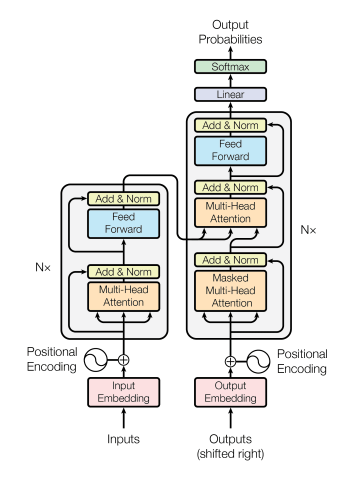
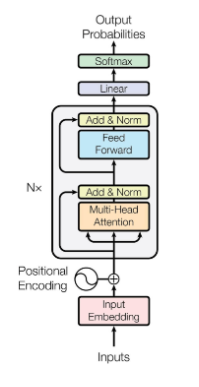
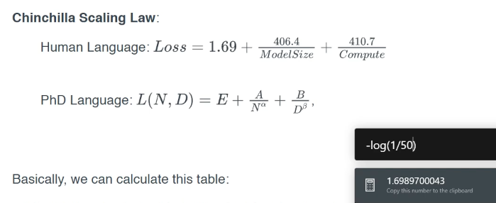
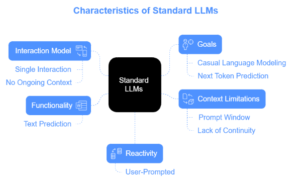
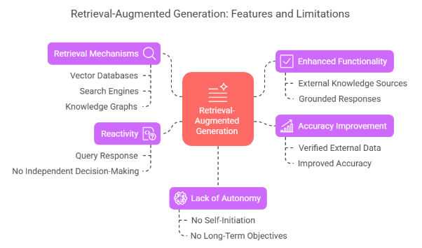
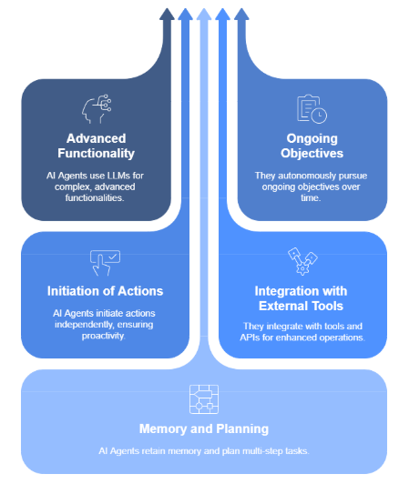
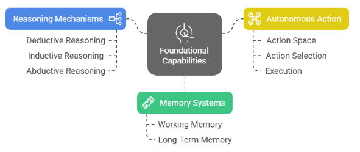

# Extensive AI for Generative Systems
- [Extensive AI for Generative Systems](#extensive-ai-for-generative-systems)
  - [S0 Version Control, Python, Cursor](#s0-version-control-python-cursor)
  - [S1 Foundations of the Transformer Architecture](#s1-foundations-of-the-transformer-architecture)
  - [S2 Modern Language Model Internals](#s2-modern-language-model-internals)
  - [S3 Introduction to Agentic AI](#s3-introduction-to-agentic-ai)
  - [S4 Planning and Reasoning with Language Models](#s4-planning-and-reasoning-with-language-models)
  - [S5 Agent Architecture - Cognitive Layers](#s5-agent-architecture---cognitive-layers)
  - [S6 Memory, Context, and State Management](#s6-memory-context-and-state-management)
  - [S7 Tool Use and External APIs](#s7-tool-use-and-external-apis)
  - [S8 Reinforcement Learning for Agentic Behaviors](#s8-reinforcement-learning-for-agentic-behaviors)
  - [S9 Advanced Prompt Engineering and Auto-Prompting](#s9-advanced-prompt-engineering-and-auto-prompting)
  - [S10 Retrieval-Augmented adn Knowledge-Graph Agents](#s10-retrieval-augmented-adn-knowledge-graph-agents)
  - [S11 Understanding Browser Based Agents](#s11-understanding-browser-based-agents)
  - [S12 Fundamentals of Web Page Parsing](#s12-fundamentals-of-web-page-parsing)
  - [S13 Context Maintenance in Browsers](#s13-context-maintenance-in-browsers)
  - [S14 Building Browser-Aware Agents](#s14-building-browser-aware-agents)
  - [S15 Introduction to Browser Automation Tools](#s15-introduction-to-browser-automation-tools)
  - [S16 Intelligent Goal Interpretation](#s16-intelligent-goal-interpretation)
  - [S17 Multi-Agent Systems and Collaboration](#s17-multi-agent-systems-and-collaboration)
  - [S18 Managing Uncertainity and Error Correction](#s18-managing-uncertainity-and-error-correction)
  - [S19 Advanced Task Orchestration](#s19-advanced-task-orchestration)
  - [S20 Capstone - Autonomous Browser Assistant](#s20-capstone---autonomous-browser-assistant)

## S0 Version Control, Python, Cursor

- [Git and Cursor 101](https://www.youtube.com/watch?v=DL9uJKqugjc)
- VCS - Version Control System - track and manage changes


## S1 Foundations of the Transformer Architecture

- Skills
  - Python
  - PyTorch
  - Git and GitHub
  - Transformers
  - Frontend Frameworks
  - DevOps
  - MLOps
  - JavaScript/TypeScript
  - SQL
  - Bash
  - JSON YAML CSV MARKDOWN HDF5 ONNX
- Concepts
  - LLMs and Transformers (architecture, fine-tuning, LoRA, RAG)
  - Prompt Engineering and Optimization
  - Memory Systems (FAISS, Milvus)
  - Planning Systems (ReACT, decision chains)
  - Tool Use and Function Calling
  - Web APIs (REST and GraphQL)
  - gRPC
  - Browser Automation (Playwright, Puppeteer, Selenium)
  - Docker 
  - Kubernetes
  - CI CD Pipelines
  - Gradio, FastAPI

- [Simon Sinek](https://www.youtube.com/watch?v=u4ZoJKF_VuA) -- START WITH WHY?
  - Why?
  - How?
  - What?
- Data > Information > Knowledge > Wisdom 


<br/><br/>

- design something that works or barely works > clean it > make it better > optimize
- Cursor and Claude -- are better according to instructor
- Cursor is code completion tool.


<br/><br/>

- CNN Convolutional Neural Networks -- 4 blocks each with different number of layers
  - Edges and Gradients -- V1 (Human Brain)
  - Textures and Patterns -- V2
  - Part of Objects -- V4
  - Objects -- IT
- LLMs -- no blocks, just layers   
- Brain is plastic -- say left half is damaged, right half can take over, and replace left half  
- [Learn Git -- GAME](https://learngitbranching.js.org/)
- Consumers vs Producers
- How to make agentic frameworks? agents? GenAI tools?

<br/><br/>

- AI Models are sets of numbers that help turn an input into an output.
- `y = mx + c` or `y = Wx + c` 
- y output, x input, W/m weights
- loss = y - y^pred
- learning rate (eta) = 0.5 -- feedback/ how much of the gradient step should you take
- tan theta +ve => as m increases Loss increases
- tan theta -ve => as m increases Loss reduces
- if we take -(tan theta) -- this takes care of above two problems
- `m' = m = eta * delta Loss / delta m


<br/><br/>

- activation functions allow model to learn non-linearity
- Neural Networks invented in 1943
- Backprop was invented by 1960s and in heavy use by 1974
- Geoffrey Hintons application to DNN in 1986
- Yann LeCun applied it to Convolutions in late 1980s
- 1989 -- Universal Approximation Theorem
  - states that feedforward neural network with a single hidden layer, given enough neurons in that layer, can approximate any continuous function to an arbitrary degree of accuracy
  - incredibly versatile, and in theory, can learn to represent very complex relatinships within data
  - matrices with a particular set of (activated) values and matrix multiplications can represent any function
- AI Winter (1990s to 2010s)
- Alex wins at 2012 ImageNet competition (15% error drop) -- first person to use 2 GPUs for weight calculations or matrix multiplication
- 2016
  - text image audio all had different neural networks to solve related problems
  - every ai model needed to be labelled and annotatedd
  - couldn't make models work on longer text or big enough for audio and video
- 2017 -- Attention is all you need! -- Vasvani Ji -- allowed model to learn to focus on what is needed
  - labelled data is not required
  - same architecture for any problem
  - simplest architecture and training strategy
  - models are interpretable
  - models can be scaled with money
- if it is possible to make model decide, then let the model decide. (say assuming learning parameter ❌)
  - 2003 - Word Embeddings: Turns words into lists of numbers, so computers can understand their relationships (like "king" being close to "queen") -- interpreting the word
  - 2014 - Neural Architecture Search by Google: Lets computers design their own neural network structures, instead of humans doing it all.
  - 2014 - Adam Optimizer: Makes neural networks learn faster and more reliably by automatically adjusting how much they change their settings -- learning learning parameter
  - 2015 - Batch Normalization: Stabilizes neural network learning by making the data flow more consistently.
  - 2015 - Attention: Allows neural networks to focus on the most important parts of input data, like highlighting key words in a sentence.
  - 2017 - Transformers: A new type of neural network that excels at understanding sequences (like text), enabling major advances in language processing.
  - 2017 - VQ-VAE: A way to create a compressed digital representation of data, such as images, by using a neural network to create a codebook.
  - 2018-2020 - RLHF (Reinforcement Learning from Human Feedback): Trains AI models to be more helpful and aligned with human preferences by rewarding them for desired outputs.
  - 2020 - Diffusion Models: Creates realistic images and other data by gradually adding and then removing noise, like reverse image blurring.
  - 2021 - CLIP (Contrastive Language–Image Pre-training): Connects images and text, allowing AI to understand how they relate to each other.
  - 2021 - LoRA (Low-Rank Adaptation): A method that allows large pre-trained models to be quickly customized for new tasks, by only training a small set of extra parameters.

<br/><br/>

- GPUs 
  - SIMD - Single Instruction Multiple Devices
  - CPU -> ALU ->  Output -- Sequential
-  -today-> 
- Input -> Encoder -> Some Output -> Decoder -> Actual  Output
- if you give model 4 words, model will output 4 words 
  - I am a good --> am a good person | am a nice person | ... 
  - essentially predicts the next sequence
  - model stops when it predicts EOS token
- Decoder only architecture -- but looks like encoder.


<br/><br/>

- Softmax -- takes a vector of numbers and outputs a vector of porbability distribution (values are between 0 and 1, and sum to 1)
- Find 3 numbers such that sum of first 2 numbers of their soft max valus is > 0.5 but < 0.56 -- can never solve this.
- Agents (Code which prompts to LLM) can become part of LLM soon. 
  - User -> agent (system or framework --say langchain) -> Model (say LLM) --> agent --> Model (say LLM) --> some output
  - LLMs can't run a program.
- Agent can be looked at as Orchestrator
- Agent provides the list of functions (as text descriptions) to LLM along with the user query -- and LLM will respond by saying which function to use, and will provide inputs etc.


<br/><br/>

- Input
  - text -- words/tokens
  - image -- patches of images
  - audio -- patches of audio, converted into spectogram(frequency over time)
  - video -- sequences of patches of video frames
  - time-series dagta -- sequence of time-stamped numerical values
  - DNA -- sequence of base pairs(GCTA)
  - code -- sequence of words and special symbols 
- Embeddings -- value for different dimensions
- Position Encoding -- tag/order
- Attention - which word has what meaning
- Multi-head -- divide dimensions into pieces of 128 or 258
- Add
- Norm -- normalization -- between -1 and +1
- Feed Forward -- we combine the dissected embeddings
- Nx -- Repeat N times
- Softmax -- probability distribution summing to 1


<br/><br/>

- LLM - Query, Answer
- RAG - Query, Data Set, Answer
- Agent - Query, Data Set / Tools, Answer


<br/><br/>

- n8n agent
- transformer kv cache
 
## S2 Modern Language Model Internals

- Neural Networks ~ Universal approximators
- CNNs - 4 blocks, brains, neural networks
  - edges and gradients
  - textures and patterns
  - part of objects
  - objects
- Neural Network -- kind of a map (layer1 to layer2)
- Loss vs Weights
- Learning rate
  - changing eta value over time based on how its learning
  - loss curves neural networks
  - Reduce LR On Plateau
  - ADAM Optimizer
  - SGD with Momentum
- Last layer is called head

<br/><br/>

- problems for text by 2016
  - longer sentences  -- 20 to 30 words | max 100 words
  - for each problem diff models (translation, summarization, spam detection, ...)
  - making models larger didn't necessarily mean better models
  - no large annotated datasets
- [SAM](https://segment-anything.com/demo)
  - Segmentation
- In CNN 
  - location is inherently available -- where exactly each pixel is
  - divided our problem into multiple sub-problems 
- Skip Connections in Residual Networks -- Highway networks
- Kernel Visualization
- 3 things
  - location knowledge made CNNs work (We use position encoding in place of this in transformer)
  - Channels allowed to segregate concepts (We use multi-head in place of this in transformer)
  - Skip connections allowed for deeper models (no need to worry about chain rule slope/gradient calculation)
- Densenet Architecture
- ViT - Vision Transformer
- Full Transformer - Encoder and Decoder
- [LLM Visualization](https://bbycroft.net/llm) 
- Bigger dimensions -- bigger models (no limit, money is the limit)


<br/><br/>

- characters -- LLM runs len(string) times
- words -- LLM runs wc(string) + 1 times
- tokens -- Byte Pair Encoding


<br/><br/>

- Tokenizer -- companies tending to keep the science secret -- how they arrived at the numbers/tokens
  - Each token has embedding
    - each embedding has multiple dimensions
- LLMs - Generative AI - GenAI
- Masking vs Inferencing
  - Masking - hiding the future words when predicting next word during training
  - Inferencing - prediction (no backpropagation to change weights)
- Pre-training objectives of LLMs
  - Casual Language Modeling (CLM) -- next token prediction
- Ollama Gemma
- 
  - 1/50 -- overall, of all the languages combined, there are 50 words that can mean the same thing?
- Chinchilla Law 


<br/><br/>

- Fine tuning
- pre-trained models are usually trained to predict next words, but not solve the prompt 
- supervised fine-tuning SFT --- instruction-tuning
  - input instruction
  - ideal response
- QLoRA - Quantized Low-Ranked Adaptation of Language Models
- Chain of Thought
- ...
  - pre-training
  - post-training
- without finetuning, it continues to add to prompt, not answer the prompt
- RAG is not training
  - it is like a small internet search for the model 
- AWS Lambda Services for Scraping Linkedin
  - computer given to you for 2.5 minutes
  - every time lambda opens up, it has different ip address
  - launch million of them, run millions of times


<br/><br/>

- to-do:
  - Leslie Smith - Learning Rate
  - One Cycle Policy

## S3 Introduction to Agentic AI

- `import code` `code.interact(local = locals())` - drop into interactive shell at any point in script
- `ctrl + D` to exit shell and continue execution 
- `exit()` exits without execution
- `locals()`
- `globals()`
- `pdb` interactive debugger - pause, inspect, breakpoints, line by line execution, ...
- `from pdb import set_trace` `set_trace()` - debugger starts here
  - `h` to list all commands
  - `n` execute next line without stepping into function
  - `c` continue until next breakpoint
  - `l` shows surrounding code
  - `q` exit trace
  - `b 12` set breakpoint at  line 12
  - `cl` clear all breakpoints


<br/><br/>

```py
import asyncio
import time

async def say_hello():
  await asyncio.sleep(2) # non-blocking sleep
  print("Hello Ash")

async def say_good_bye():
  await asyncio.sleep(1)
  print("Goodbye World!")

async def main():
  start = time.time()

  await asyncio.gather(say_hello(), say_good_bye())

  total = time.time() - start
  print(f'total time {total:.2f}')

asyncio.run(main() )
```


<br/><br/>

- RAG -> Agentic Systems
- Biggies crushing Agentic Companies
  - New Agentic Companies
    - promoting number of tools to integrate
    - use any models
  - Biggies strike back
    - OpenAI - function calling and agents sdk
    - customizing LLMs to enterprise needs
    - Anthropic - MCP (protocol that allows any application to become a tool)
  - knowing the framework -> mcp-based tools
  - [Blender MCP](https://www.youtube.com/watch?v=oN1LoMz-6VM)
  - [Cursor talk to Figma MCP](https://github.com/sonnylazuardi/cursor-talk-to-figma-mcp)
  - [MCP Servers](https://github.com/modelcontextprotocol/servers)
  - [Awesome MCP Servers](https://github.com/appcypher/awesome-mcp-servers)


<br/><br/>

- [Emergent Abilities in LLM](https://arxiv.org/pdf/2206.07682)
  - capabilities or behaviors that arise in these models as a result of their increased scale
    - unpredictable
    - threshold dependent - model size or complexity 
    - quantitative shihft - significant improvement
    - generalization
  - theoretical explanation 
    - scale 
    - representation learning
    - phase transition


<br/><br/>

- AI System
  - LLM - predicts next token
    - 
  - RAG
    - 
  - AI Agent - perceive environment, make decisions, and take actions to achieve goals
    - 

- Pillars of Agency | Agent Characteristics
  - Goal-Directed Behavior
  - Interactive Capability
  - Autonomous Decision-Making
- Core capabilities
  - 
- reasoning
  - deductive - drawing logical conclusions from premises
  - inductive - forming generalizations from specific observations
  - abductive - making best guesses on incomplete information
- complex pattern recognition - across knowledge domains
- implicit knowledge synthesis - drawing conclusions from scattered information
- meta-cognition - assessing its own reasoning and refining its thought process  
- memory 
  - working memory - immediate context and recent interactions
  - long-term memory - persistance across sessions
- autonomous action
  - action space - all possible actions
  - action selection - evaluating which actions best serve goal

## S4 Planning and Reasoning with Language Models


## S5 Agent Architecture - Cognitive Layers


## S6 Memory, Context, and State Management


## S7 Tool Use and External APIs


## S8 Reinforcement Learning for Agentic Behaviors


## S9 Advanced Prompt Engineering and Auto-Prompting


## S10 Retrieval-Augmented adn Knowledge-Graph Agents


## S11 Understanding Browser Based Agents


## S12 Fundamentals of Web Page Parsing


## S13 Context Maintenance in Browsers


## S14 Building Browser-Aware Agents


## S15 Introduction to Browser Automation Tools


## S16 Intelligent Goal Interpretation


## S17 Multi-Agent Systems and Collaboration


## S18 Managing Uncertainity and Error Correction


## S19 Advanced Task Orchestration


## S20 Capstone - Autonomous Browser Assistant
